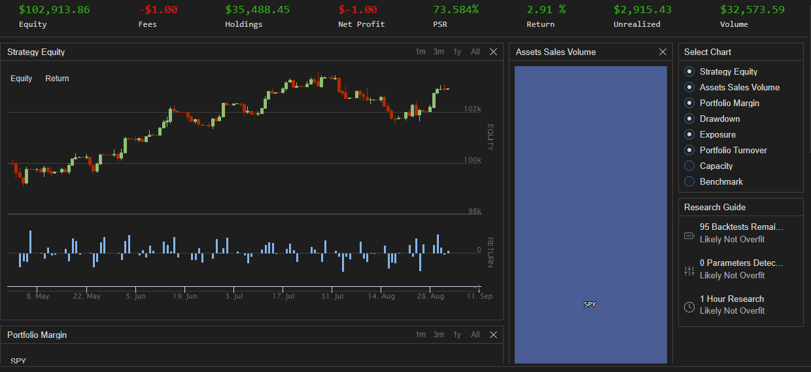

Here's the updated README for your `POWEREARNINGSCALE` algorithm, now including the uploaded screenshot.

---

# POWEREARNINGSCALE Algorithm

## Overview
The `POWEREARNINGSCALE` algorithm is a quantitative trading strategy designed to analyze earnings gaps and price strength following earnings reports for S&P 500 companies. The backtesting period runs from April 30, 2023, to September 2, 2023, with an initial cash balance of $100,000. The strategy aims to identify promising stock opportunities based on their post-earnings performance, utilizing dynamic stock selection, earnings gap analysis, and diversified portfolio management.

## Components

### Initialization
- **Set Dates and Cash**: Defines the backtesting period from April 30, 2023, to September 2, 2023, starting with a cash balance of $100,000.
- **Equity and Universe Selection**:
  - Adds SPY as the base equity symbol.
  - Implements a universe filter for stocks with adequate liquidity and market cap, focusing on stocks with fundamental data.
- **Scheduled Action**: Runs the analysis every day, one minute after market open, to assess stock performance.

### Universe Selection
- **Coarse Filter**: Selects assets based on:
  - Dollar volume > $1,000,000
  - Price > $10
  - Availability of fundamental data
  - Chooses the top 500 stocks by dollar volume.
- **Fine Filter**: Further filters the universe to include:
  - Stocks with earnings data
  - Market cap > $1 billion

### Earnings Gap Analysis
- **AfterMarketOpen Method**:
  - Iterates through the filtered stocks, excluding SPY.
  - Retrieves historical data for the last 7 days to access open, close, and high prices after earnings.
  - **Gap Calculation**:
    - Calculates the gap and percentage change between the close price before earnings and the open price after earnings.
    - Evaluates close strength to determine if the stock closed strong or faded.
  - **Conditions for Analysis**:
    - A price gap greater than 5% triggers further evaluation, determining if the stock closed strongly or faded after earnings.

### Portfolio Management
- **OnData Method**:
  - Diversifies the portfolio by investing equally in SPY, BND, and AAPL (33% allocation each), assuming the portfolio is not already invested.

## Performance Metrics
The algorithm's performance is evaluated based on equity growth, returns, and portfolio management metrics. Below is a screenshot demonstrating the algorithm's backtesting performance:

- **Equity**: Displays overall strategy equity growth over time.
- **Returns**: Highlights daily returns to assess volatility and performance.
- **Asset Sales Volume**: Visualizes the volume of SPY, providing insights into sales activity.

### Research Guide Insights
- **Backtesting Results**: The algorithm's research guide indicates:
  - Likely not overfitting, as shown by the number of backtests and parameter checks.
  - Short research timeframes suggest efficient strategy processing.

## Logging and Debugging
The algorithm includes `self.Debug()` statements to provide insights during its execution, highlighting data availability, earnings gaps, and performance conditions.

## Usage
This algorithm identifies stocks with significant post-earnings performance, analyzing gaps and strengths to make informed trading decisions. It leverages universe filtering and gap analysis to maximize potential returns while maintaining diversified portfolio exposure.

## Dependencies
- Relies on the `AlgorithmImports` library from QuantConnect for importing necessary modules and functions.

## How to Run
1. Clone the repository and open the algorithm file in QuantConnect or a local development environment.
2. Upload the code to QuantConnect and set the backtesting parameters.
3. Run the algorithm to analyze the performance based on historical data.

---

This README file provides a comprehensive overview of the algorithm, its logic, and its performance insights, including the newly added screenshot. Let me know if you need any further modifications!
